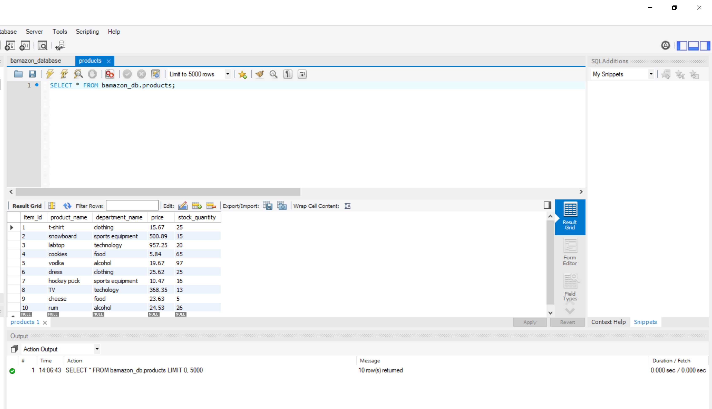
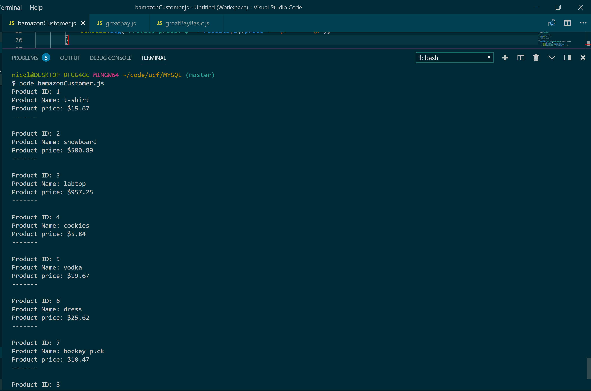
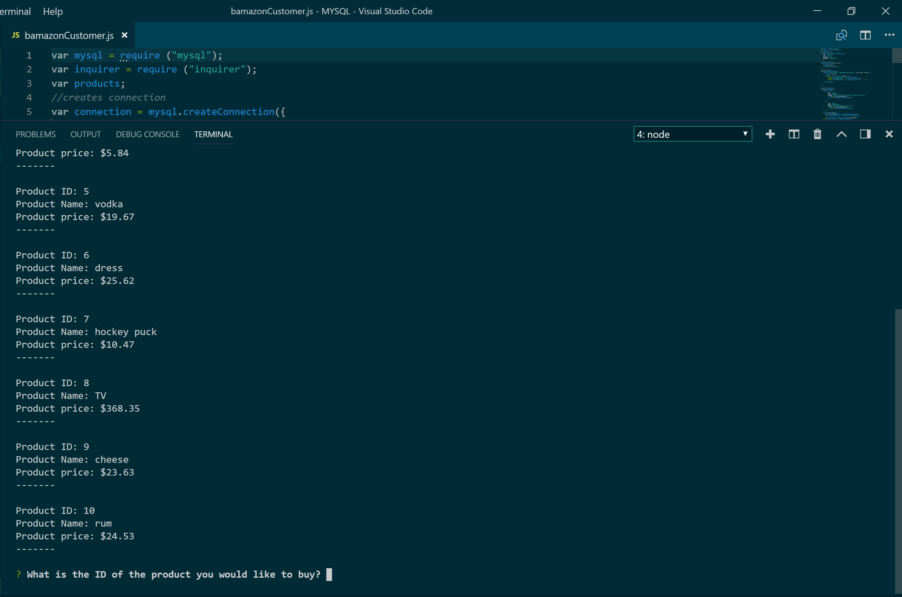
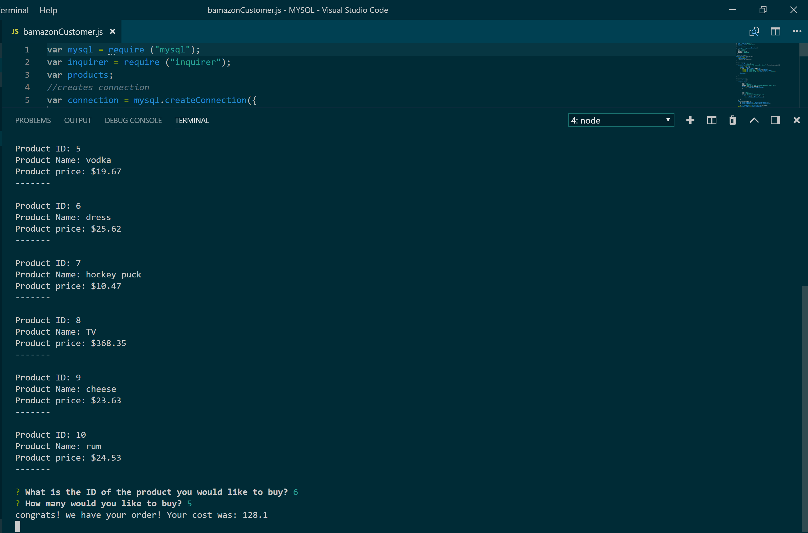
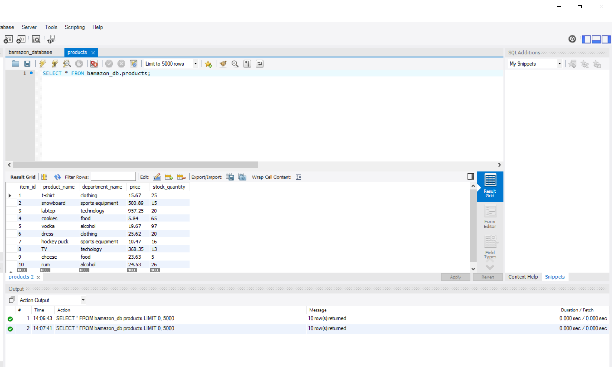

# MYSQL

<h1>Part 1

First we take a look at the database created (note item 6, dresses and it states that we have 25 in stock)

Then we go to the terminal and ask for it to show us the databased and what we can buy on our Bamazon

Then it asks us what product we would like to buy (here we have chosen dresses)

Then it asks us how many of that product we want and our total. Also that our order has successfully been placed! yay! (here it is 5 dresses for a total of $128.10)

Then we take a look at the updated database. Noting that the dresses went from 25 count (the original number in stock, subtracted our order amount, and has a result of 20 in stock)
 